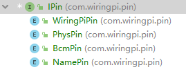

# WiringPi-Java

WiringPi的Java版本，通过Java-JNI调用WiringPi库。


- `com.wiringpi.jni` JNI所在包，包含了`Java`调用`WiringPi`的`native`方法，目前实现了常用的`WiringPi`、`SoftPwm`、`SoftTone`、`WiringPiI2C`
- `com.wiringpi.pin` 树莓派引脚的对应关系，当前已预设物理引脚、WiringPi引脚、BCM引脚的映射关系
- `com.wiringpi.gpio` 通过引脚创建一个GPIO对象，对象中涵盖了该引脚的大多数操作（省去调用WiringPi时传入pin参数操作）


JNI中尽量的保留了与`WiringPi`一致的调用方式，力求可以很容易的把C语言版本的代码移植到Java中运行。

`com.wiringpi.jni.WiringPiSetup` 对象中涵盖了 `WiringPi` 初始化的几个函数。

`com.wiringpi.jni.WiringPi` 对象中涵盖了 `WiringPi` 中所有的函数，其调用方式基本上与原生的 `WiringPi` 调用方式一致。


## 示例

### 初始化一个引脚

当使用 `wiringPiSetup()` 初始化`WiringPi`时，使用`BcmPin`、`WiringPiPin`、`PhysPin`都会自动使用WiringPi的引脚。

目前支持在使用`wiringPiSetup()`或`wiringPiSetupPhys()`初始化时，会自动转换成`WiringPi`引脚或者物理引脚。

详细代码请看 [com.wiringpi.pin.IPin#pin(com.wiringpi.pin.IPin)](src/main/java/com/wiringpi/pin/IPin.java) 



```java
// 在使用 wiringPiSetup() 或 wiringPiSetupPhys() 初始化时，下面四种初始化引脚都将指向同一个物理引脚，里面都包含了名称引脚到物理引脚的映射关系。
Gpio gpio;
gpio = BcmPin.p17.gpio();
gpio = WiringPiPin.p00.gpio();
gpio = PhysPin.p11.gpio();
gpio = NamePin.GPIO_0.gpio();
// 以上四种将会先把该类型pin值转换成物理pin值，再由物理pin值转换成目标类型的pin值。
// 例如BcmPin.p17的转换过程：BcmPin.p17 -> 物理引脚11 -> WiringPi引脚0
```

设置引脚模式

```java
Gpio gpio;
gpio = BcmPin.p17.gpio();
gpio.pinMode(com.wiringpi.pin.modes.PinMode.OUTPUT);
// 或者
WiringPi.pinMode(gpio.getPin(), com.wiringpi.jni.modes.PinModes.OUTPUT);
// 其中 com.wiringpi.jni.modes.PinModes.OUTPUT 是一个常量，其值为1
// 而 PinMode.OUTPUT 是一个枚举，其 PinMode.OUTPUT.value() 将返回对应的值1
```

